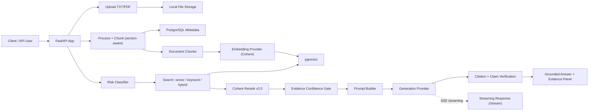

# BreathX RAG — Clinical Asthma Q&A

<div align="center">

**A safety-first RAG backend for evidence-grounded clinical asthma questions — built on GINA 2026, NICE NG80, and NHLBI guidelines, with multi-layer guardrails and a golden-labeled benchmark.**

[](https://www.python.org/)
[](https://fastapi.tiangolo.com/)
[](https://github.com/pgvector/pgvector)
[](https://cohere.com/rerank)
[](https://cohere.com/)
[](#unit-tests)

</div>

---

## Table of Contents

- [Overview](#overview)
- [Key Results](#key-results)
- [Architecture](#architecture)
- [Tech Stack](#tech-stack)
- [Quick Start](#quick-start)
- [API Reference](#api-reference)
- [Evaluation](#evaluation)
- [Unit Tests](#unit-tests)
- [Safety Configuration](#safety-configuration)
- [Project Structure](#project-structure)
- [Configuration Reference](#configuration-reference)
- [Notes](#notes)

## Overview

BreathX RAG is a FastAPI RAG backend purpose-built for **clinical asthma questions**. It ingests guideline PDFs (GINA, NICE, NHLBI), chunks them section-aware and embeds them into a pgvector store, and generates grounded, citation-backed answers — while refusing personal-symptom, out-of-scope, and emergency queries at the safety layer.

Every answer passes through one shared pipeline (`NLPController.prepare_rag_context`): **classify risk → retrieve (hybrid) → rerank → evidence gate → prompt assembly → generation → citation & claim verification**. The JSON and SSE endpoints consume the same pipeline, so they cannot drift apart.

The system is benchmarked against a 22-question golden-labeled retrieval set (20 clinical + 2 true-negatives) and a 30-case answer-quality harness, both automated in `scripts/`.

## Key Results

| Metric | Score | Target | Status |
|---|---:|---:|:-:|
| Hit Rate@5 (rerank) | **0.900** | ≥0.90 | ✅ |
| Hit Rate@10 (rerank) | **1.000** | ≥0.95 | ✅ |
| Refusal Accuracy | **1.000** | =1.00 | ✅ |
| Citation Faithfulness | **1.000** | ≥0.95 | ✅ |
| Safety Classifier Accuracy | **1.000** | =1.00 | ✅ |
| Unsupported Claim Rate | **0.000** | =0.00 | ✅ |
| Language Fidelity (Arabic) | **1.000** | =1.00 | ✅ |
| Unit Tests Passing | **59/59** | 100% | ✅ |
| Precision@3 (rerank) | 0.333 | ≥0.40 | ⚠️ |
| Precision@5 (rerank) | 0.260 | ≥0.30 | ⚠️ |

Full benchmark dashboard: `eval/benchmark_dashboard_FINAL_20260814.md`

### Performance (30-case answer eval)

| | Before Optimization | After Optimization | Change |
|---|---:|---:|---:|
| **Total elapsed** | 375.9s | 237.2s | **−37%** |
| **Avg per question** | 12.5s | 7.9s | **−4.6s** |
| Safety accuracy | 0.967 | 1.000 | +0.033 |
| Refusal accuracy | 0.967 | 1.000 | +0.033 |
| Citation faithfulness | 0.953 | 1.000 | +0.047 |
| Keyword hit rate | 0.900 | 1.000 | +0.100 |

Optimizations: parallelized hybrid search sub-queries, cached settings and compiled patterns, eliminated redundant DB queries. Zero logic changes — same retrieval, rerank, and generation.

## Architecture



### Answer Pipeline Phases

Both `/answer` endpoints emit the same phases (SSE clients see them as `phase` events):

`classifying` → `retrieving` → `reranking`* → `checking_evidence` → `generating` → `verifying` (*only when rerank is enabled)

### Safety Layers

| Layer | What it does | Target |
|---|---|---|
| **Risk Classifier** | Refuses emergency/personal/out-of-scope queries | 1.00 accuracy |
| **Confidence Gate** | Blocks generation when evidence score/count is too low | 100% refusals on weak evidence |
| **Citation Verifier** | Validates each `[Doc, p. N]` against source chunks | 1.00 faithfulness |
| **Unsupported Claim Detector** | Flags numeric claims absent from evidence | 0.00 unsupported rate |
| **Language Fidelity** | Arabic queries get Arabic answers | 1.00 fidelity |

### Retrieval Modes

| Mode | P@3 | P@5 | HitRate@5 | HitRate@10 |
|---|---:|---:|---:|---:|
| **rerank** (hybrid + Cohere) | **0.333** | **0.260** | **0.900** | **1.000** |
| hybrid (vector + BM25 RRF) | 0.283 | 0.220 | 0.900 | 1.000 |
| keyword (BM25) | 0.217 | 0.200 | 0.700 | 0.850 |
| vector | 0.217 | 0.150 | 0.600 | 0.750 |

> `score_threshold` semantics: comparable against cosine similarity in `vector` mode and against reranker relevance scores after reranking. Raw hybrid RRF and keyword `ts_rank` scores are rank-based and are never filtered by it.

## Tech Stack

| Layer | Technology |
|---|---|
| API | FastAPI + Uvicorn |
| Database | PostgreSQL + pgvector (Docker) |
| Embeddings | Cohere embed models or OpenAI-compatible endpoints (e.g. `embed-multilingual-light-v3.0`, `bge-m3`) — set via `.env` |
| Reranker | Cohere `rerank-v3.5` |
| LLM | Cohere Command family or OpenAI-compatible endpoints — set via `.env` |
| Vector Store | pgvector (HNSW index above row threshold) + optional Qdrant provider |
| Config | pydantic-settings, `.env` |
| Migrations | Alembic |
| Eval | Custom harnesses (`eval_retrieval_v2.py`, `eval_answers.py`) |
| Tests | pytest (59 unit tests) |

## Quick Start

> All commands run from `src/` — the app uses flat imports (`from helpers.config import ...`).

### 1. Start Postgres

```bash
cd docker
# create docker/.env (see docker/.env.example) with POSTGRES_PASSWORD
docker-compose up -d
```

Host port `5433`; the `breathX` database is created automatically.

### 2. Install dependencies

```bash
cd src
pip install -r requirements.txt
```

### 3. Configure

```bash
copy .env.example .env        # Windows  (cp on Linux/macOS)
# then fill in COHERE_API_KEY and/or OPENAI_API_KEY
```

Minimum viable settings (see [.env.example](src/.env.example) for all options):

```env
COHERE_API_KEY="<your-key>"
EMBEDDING_MODEL_ID="embed-multilingual-light-v3.0"
EMBEDDING_MODEL_SIZE=384      # must match the embedding model
GENERATION_MODEL_ID="command-a-03-2025"
VECTOR_DB_BACKEND="PGVECTOR"
```

### 4. Migrate

```bash
cd models/db_schemas/breathx_rag
copy alembic.ini.example alembic.ini   # then edit the DB URL
alembic upgrade head
cd ../../..
```

### 5. Run

```bash
uvicorn main:app --reload
```

Swagger: `http://localhost:8000/docs`

### 6. Ingest documents

```bash
# Upload
curl -X POST http://localhost:8000/api/v1/data/upload/1 \
  -F "file=@Dataset/GINA_2026.pdf"

# Process (chunk)
curl -X POST http://localhost:8000/api/v1/data/process/1

# Index (embed + store vectors)
curl -X POST http://localhost:8000/api/v1/nlp/index/push/1
```

Indexing is incremental — `/index/push` picks up only chunks not yet embedded, so re-run it freely after adding files.

### 7. Ask a question

```bash
curl -X POST http://localhost:8000/api/v1/nlp/index/answer/1 \
  -H "Content-Type: application/json" \
  -d '{"text": "What is the preferred controller at Step 1?", "limit": 8}'
```

## API Reference

Base URL: `http://localhost:8000` · Swagger: `/docs`

| Method | Path | Purpose |
|---|---|---|
| GET | `/api/v1/` | Welcome / health |
| POST | `/api/v1/data/upload/{project_id}` | Upload TXT/PDF (+ optional `document_name`, `source_url`, `org` form fields) |
| POST | `/api/v1/data/process/{project_id}` | Chunk uploaded files (`chunking_method`: section/recursive/simple/semantic) |
| POST | `/api/v1/nlp/index/push/{project_id}` | Embed unindexed chunks into the vector collection (`do_reset` to wipe) |
| GET | `/api/v1/nlp/index/info/{project_id}` | Collection stats |
| POST | `/api/v1/nlp/index/search/{project_id}` | Retrieval only — modes: `vector` / `keyword` / `hybrid`, optional rerank |
| POST | `/api/v1/nlp/index/answer/{project_id}` | Full RAG answer (JSON) |
| POST | `/api/v1/nlp/index/answer/{project_id}/stream` | Full RAG answer (SSE stream) |

Notable request fields on search/answer:

| Field | Default | Notes |
|---|---|---|
| `retrieval_mode` | `hybrid` | `vector` / `keyword` / `hybrid` |
| `rerank` | `true` (answer), `false` (search) | Cohere rerank over candidates |
| `expand_query` | `true` (answer) | Asthma abbreviation/synonym expansion before retrieval |
| `score_threshold` | from settings | See [semantics](#retrieval-modes) — applies to vector similarity or post-rerank relevance only |
| `verify_claims` | `true` | Deterministic citation + claim-support checks |
| `conversation_history` | `[]` | Prior turns (`{"question", "answer"}`, oldest first) for follow-up questions |

Answer response includes: `answer`, `sources` (doc/page/section/score per chunk), `confidence` (+ `confidence_summary`), `quality` (citations, unsupported claims, faithfulness rates), `risk_assessment`, `evidence_panel`, `disclaimer`.

### Streaming Responses

```bash
curl -N -X POST http://localhost:8000/api/v1/nlp/index/answer/1/stream \
  -H "Content-Type: application/json" \
  -d '{"text": "What is the preferred controller at Step 1?"}'
```

**SSE event types:**

| Event | Payload | Description |
|---|---|---|
| `phase` | `{"phase": "..."}` | Pipeline stage started (see [phases](#answer-pipeline-phases)) |
| `token` | `{"token": "..."}` | Generated token |
| `done` | Full answer payload | Final answer with sources, quality metrics, evidence panel |

If LLM streaming fails mid-flight, the endpoint falls back to a non-streaming call delivered as a single `token` event with `"full": true`. For patient-specific ("needs caution") queries the safety disclaimer is streamed as the very first token, so client-side accumulation always equals the final `done.answer`.

## Evaluation

### Retrieval (22 questions · 4 modes × 3 K values)

```bash
python ../scripts/eval_retrieval_v2.py --project-id 1
# → eval/results_<timestamp>.md
```

20 clinical questions + 2 true-negatives. Relevance rule: doc hint in `document_name` AND `page_number` within ±2 of golden window AND any golden keyword in chunk text.

### Answer quality (30 cases)

```bash
python ../scripts/eval_answers.py --project-id 1
# → eval/answer_results_<timestamp>.md
```

Covers: direct clinical, multi-chunk, patient-specific, refusal (emergency/personal/out-of-scope/pet), ambiguous, adversarial injection, language fidelity, instruction-override resistance.

### Other tooling

| Script | Purpose |
|---|---|
| `scripts/audit_golden_labels.py` | Audit golden labels vs indexed DB chunks |
| `scripts/benchmark_dashboard.py` | Aggregate eval reports into a dashboard |
| `scripts/chunk_diagnostics.py` | Inspect chunking output quality |
| `scripts/ingest_guidelines.py` | Download/verify source PDFs from `Dataset/manifest.json` |
| `scripts/profile_answer_latency.py` | Per-phase latency breakdown |

## Unit Tests

```bash
pytest tests/test_core.py -v
```

59 tests across 13 classes:

| Class | Tests | What it covers |
|---|---:|---|
| TestSafetyClassifier | 18 | Emergency, personal dosing, out-of-scope, pets-as-trigger, programming, Arabic |
| TestConfidenceGate | 7 | High/medium/low/insufficient confidence, score thresholds, non-official docs |
| TestQueryExpansion | 10 | MART, SABA, GINA, NICE, NHLBI, step-down, non-pharmacological, exacerbation |
| TestCitationVerification | 5 | Single, multi, unsupported, combined-bracket splitting, no-citation |
| TestPGVectorIdentifierValidation | 3 | SQL-safe collection-name validation |
| TestAnswerQuality | 2 | Empty answer, cited-answer faithfulness |
| TestUnsupportedClaims | 2 | Supported vs unsupported numeric claims |
| TestCoHereEmbedInputType | 2 | Query vs document embedding input types |
| TestScoreThresholdSemantics | 2 | Threshold applied post-rerank; never on ts_rank scores |
| TestSettingsCache | 2 | Cached settings identity + reset |
| TestOrgAliasesHotReload | 2 | Citation org aliases reload on config change |
| TestDedupeDocuments | 2 | Candidate dedupe by chunk id/text |
| TestResultModels | 2 | Typed result dataclass contracts |

## Safety Configuration

Risk rules are hot-reloadable from `src/config/safety_config.json` — add patterns without touching code. The classifier evaluates rules in order; first match wins.

Risk levels: `refuse_redirect` → `needs_caution` → `allowed`.

Refusal reasons: `possible_emergency`, `personal_medication_advice`, `animal_or_pet_question`, `clearly_non_clinical`, `outside_asthma_scope`, `empty_query`.

## Project Structure

```
RAG_AI_Hackathon/
├── docker/                          # PostgreSQL pgvector (Docker Compose)
├── Dataset/                         # Source guideline PDFs + manifest.json
├── eval/
│   ├── clinical_questions_v2.json   # 22 golden-labeled retrieval questions
│   ├── answer_cases_v2.json         # 30 answer-quality test cases
│   └── *_<timestamp>.md|json       # Generated eval reports & diagnostics
├── scripts/
│   ├── eval_retrieval_v2.py         # Retrieval eval harness
│   ├── eval_answers.py              # Answer-quality eval harness
│   ├── DEMO_eval_retrieval.py       # Demo variants of both harnesses
│   ├── DEMO_eval_answers.py
│   ├── audit_golden_labels.py       # Golden-label audit tool
│   ├── benchmark_dashboard.py       # Report aggregation
│   ├── chunk_diagnostics.py         # Chunking inspection
│   ├── ingest_guidelines.py         # PDF download/verification
│   └── profile_answer_latency.py    # Latency profiling
├── src/
│   ├── main.py                      # App entry, lifespan wiring
│   ├── requirements.txt
│   ├── .env.example                 # Configuration template
│   ├── .env                         # gitignored runtime config (required)
│   ├── config/
│   │   └── safety_config.json       # Risk rules, refusals, org aliases
│   ├── controllers/
│   │   ├── NLPController.py         # Core pipeline: classify → retrieve → verify → answer
│   │   ├── DataController.py        # Upload validation & storage
│   │   └── ProccesController.py     # Loaders + section-aware/semantic chunkers
│   ├── routes/                      # Endpoints + pydantic schemas
│   ├── models/                      # SQLAlchemy schemas + DB access models
│   │   └── db_schemas/breathx_rag/alembic/   # Migrations
│   ├── stores/
│   │   ├── llm/                     # Cohere + OpenAI-compatible providers
│   │   ├── rerank/                  # Cohere rerank provider
│   │   ├── vectordb/                # pgvector + Qdrant providers
│   │   ├── templates/               # Prompt templates (en, ar)
│   │   └── tts/                     # Edge TTS (voice responses)
│   ├── helpers/                     # Settings + hot-reloading safety config
│   ├── tests/
│   │   └── test_core.py             # 59 unit tests
│   ├── static/index.html            # Minimal web UI
│   └── assets/files/{project_id}/   # Uploaded source files
└── README.md
```

## Configuration Reference

Full annotated template: [`src/.env.example`](src/.env.example). Retrieval-critical variables:

| Variable | Example value | Purpose |
|---|---|---|
| `EMBEDDING_MODEL_ID` | `embed-multilingual-light-v3.0` | Embedding model name |
| `EMBEDDING_MODEL_SIZE` | `384` | Vector dimension (**must match the model**) |
| `GENERATION_MODEL_ID` | `command-a-03-2025` | Generation LLM |
| `VECTOR_DB_BACKEND` | `PGVECTOR` | `PGVECTOR` or `QDRANT` |
| `RETRIEVAL_TOP_K` | `20` | Pre-rerank candidate pool size |
| `RERANK_TOP_K` | `10` | Post-rerank selection count |
| `HYBRID_RRF_K` | `30` | Reciprocal rank fusion constant |
| `ANSWER_MIN_TOP_SCORE` | `0.45` | Confidence gate: minimum top score to allow generation |
| `ANSWER_MIN_EVIDENCE_COUNT` | `1` | Confidence gate: minimum official evidence chunks |
| `ANSWER_TOP_K` | `8` | Chunks placed in the generation prompt |
| `MAX_CONTEXT_CHARS` | `12000` | Prompt context budget for retrieved documents |
| `DEFAULT_CHUNKING_METHOD` | `section` | `section` / `recursive` / `simple` / `semantic` |

## Notes

- `src/.env` is gitignored; the app will not start without it. Copy it from `src/.env.example`.
- `EMBEDDING_MODEL_SIZE` must match the embedding model; changing it orphans existing collections.
- `do_reset=1` on process/index wipes that project's vector collection and chunks (the collection cache is invalidated correctly).
- CORS allows any `localhost` port (regex-based). Frontend served from any port works.
- Editing `src/.env` requires a manual server restart (code changes auto-reload); editing `safety_config.json` does **not** — rules, patterns, refusal texts, and citation aliases hot-reload by file mtime.
- Naming fixed to `ProcessController`/`ProcessRequest` (JSON API unchanged); `chunk_size` kept for DB/API compatibility.
- Startup runs an idempotent schema guard (`chunks.chunk_indexed`); Alembic remains the authoritative migration path.

## License

MIT
